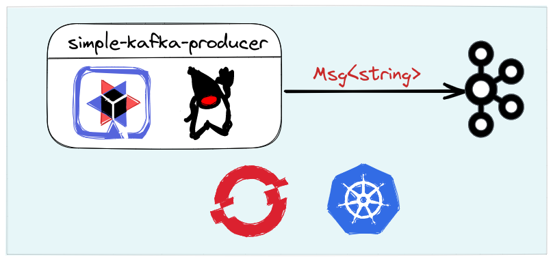

# Quarkus Kafka

This repository includes a few examples of Quarkus use with Kafka. 

* **simple-kafka-producer:** producer sends information as string to the indicated topic.
* **simple-kafka-consumer:** consumer receives information as string from the topic indicated in the properties file.
* **json-kafka-consumer:** consumer receives information as json from the topic indicated in the properties file.
* **json-kafka-consumer:** consumer receives information as json from the topic indicated in the properties file.

# Simple Kafka producer

# Simple Kafka consumer

# JSON Kafka consumer

# JSON Kafka consumer